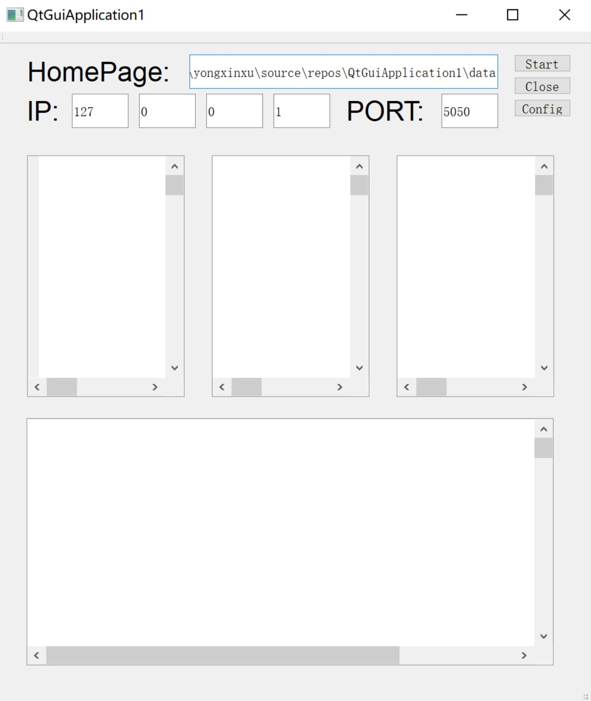
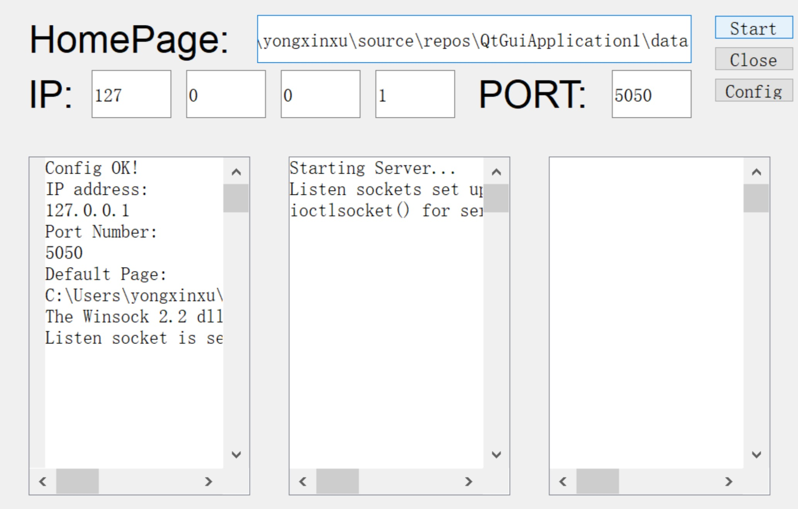
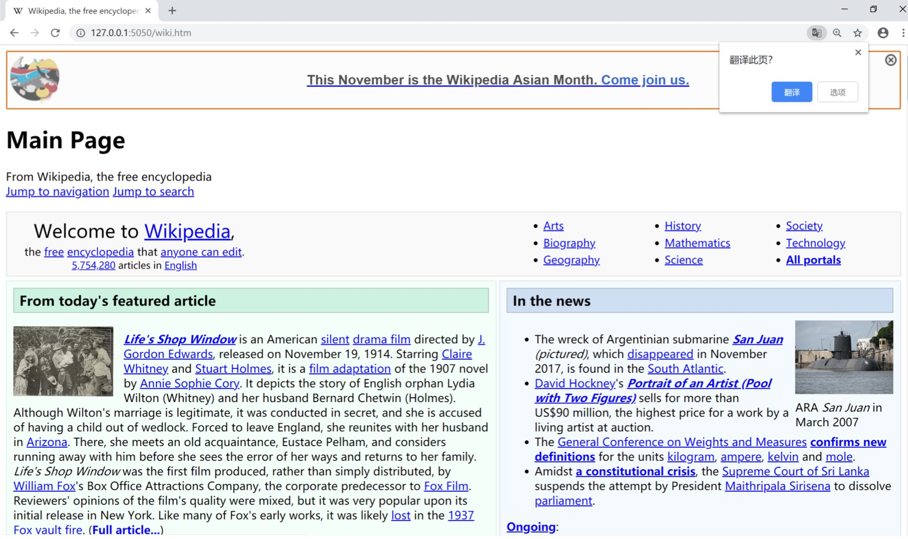

# 简单的HTTP多线程服务器

| **系统硬件**       | MacBook Pro (13-inch, 2016, Four Thunderbolt 3 Ports) |
| ------------------ | ----------------------------------------------------- |
| **操作系统**       | Windows 10 pro                                        |
| **编译器**         | MSVC2017                                              |
| **集成开发环境**   | Microsoft Visual Studio Community 2017 Version 15.8.6 |
| **开发语言及标准** | C++11                                                 |
| **GUI界面组件**    | QT5.11.2                                              |

可执行文件为`./Release/QtGuiApplication1.exe`(默认名没有改...)

配置⼀一些参数，注意⾸首先要配置⽬目录，端⼝口和IP默认了了，但是也可以修改，如果错误会显示的。
⽬目录可以配data⽬目录，⾥里里⾯面存了了⼀一些基本的⽂文件，配置例例⼦子如下:

先点Config再点Start

成功后便可以上浏览器发送请求

便可以返回一些已经预存在本地的文件信息(图中的一些wiki的htm组件是提前下载到本地的)